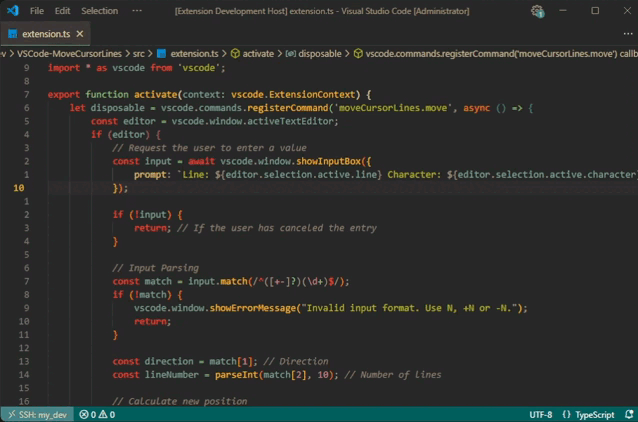

# Move Cursor Lines

A new `Go to Line/Column` that allows you to move across lines relative to the current position, as for example in vim writing /+10 moves the cursor 10 lines down.

## Features

Replaces the default `Go to Line/Column` with a new one that knows how to move across rows relative to the current cursor position.

When you press the `Ctrl+G` shortcut, a new input window will now appear, allowing you to enter row move values

Movement Methods:

- `N`: move the cursor to N line
- `+N`: move the cursor down N lines
- `-N`: move the cursor up N lines

## Extension Settings
This extension contributes the following settings:

- `moveCursorLines.changeColumn`: how to move the cursor relative to the columns. There are 3 values available:
    - `start`: move the cursor to the beginning of the line.
    - `end`: move the cursor to the end of the row.
    - `save`: keep the cursor column position.

## Known Issues

### Is it possible to move columns separately?

Not at the moment, you can configure the behavior of moving by columns with the `moveCursorLines.changeColumn` parameter.

## Release Notes